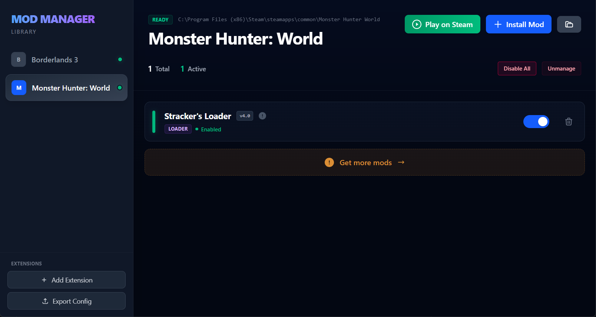

# Proteus Mod Manager (PMM)

> [!IMPORTANT]
> Proteus Mod Manager is currently in early development, so it's expected to have some bugs.

A modern, extensible Mod Manager application built with Electron, React, and TypeScript, supporting custom plugins for various games.

## Extension/Plugin Development Guide

The Proteus Mod Manager is designed to be agnostic to the specific game it manages. Support for games is added via **Plugins**.

### Plugin Structure

Plugins can be single `.js` files in the `plugins/` directory, or subdirectories containing an `index.js`.

**Single File:**
`plugins/mygame.js`

**Folder (Recommended for distributing bundled resources):**
`plugins/mygame/index.js`

Each plugin must export a default object containing metadata and lifecycle hooks.

The plugin runs in a **Sandboxed Environment** (`vm2`) for safety. You do not have direct access to Node.js built-ins like `fs` or `child_process`. Instead, you use the provided `sandbox.manager` API.

### Basic Template

Create a new file `plugins/mygame.js`:

```javascript
module.exports.default = {
  id: 'mygame', // Internal ID (no spaces)
  name: 'My Game', // Display Name
  steamAppId: '123450', // Steam App ID (for detection)
  executable: 'bin/game.exe', // Relative path to executable from Game Root

  // Optional: Define download sources (replaces old nexusSlug)
  modSources: [
    { text: 'Nexus Mods', url: 'https://www.nexusmods.com/mygame' },
    { text: 'Mod Wiki', url: 'https://wiki.example.com/mods' }
  ],

  // Optional: Supported file extensions for the "Install Mod" dialog
  // Defaults to ['zip', 'rar', '7z', 'mod'] if not specified.
  modFileExtensions: ['zip', 'rar', '7z', 'pak', 'myformat'],

  /**
   * Detects if the game is installed in one of the candidate paths.
   * @param {string[]} candidates - List of likely Steam library folders.
   * @returns {string|null} - Absolute path to the Game Root or null.
   */
  detect: async (candidates) => {
    const path = require('path')
    for (const folder of candidates) {
      const check = path.join(folder, 'My Game', 'bin', 'game.exe')
      if (sandbox.manager.fileExists(check)) {
        return path.join(folder, 'My Game')
      }
    }
    return null
  },

  /**
   * Run when the user first selects the game or performs "Prepare for Modding".
   * Used to download Mod Loaders, create folders, etc.
   * @param {string} gamePath - Absolute path to the Game Root.
   */
  prepareForModding: async (gamePath) => {
    sandbox.console.log('Preparing game...')
    // Example: Download a required DLL
  },

  /**
   * Verifies if the game is ready for mods (e.g. is the Loader installed?).
   * Used to show the "Requirements Missing" banner.
   * @param {string} gamePath
   */
  checkRequirements: async (gamePath) => {
    const path = require('path')
    const loaderExists = sandbox.manager.fileExists(path.join(gamePath, 'bin', 'loader.dll'))

    if (loaderExists) return { valid: true }

    return {
      valid: false,
      message: 'Mod Loader is missing!',
      links: [{ text: 'Download Loader', url: 'https://example.com/download' }]
    }
  },

  /**
   * (Optional) Determine the type of mod based on its files.
   * Can also return advanced metadata like Nexus ID, source URL, version, etc.
   * @param {string} stagingPath - Path where the mod zip was extracted.
   * @returns {string|object|null} - Mod type string or object with metadata.
   */
  determineModType: async (stagingPath) => {
    // Return Object Example:
    /*
    return {
      type: 'Loader',
      nexusId: '123',
      nexusDomain: 'site', // Optional: override domain for Nexus API (e.g. 'site' for generic tools)
      sourceUrl: 'https://example.com',
      note: 'Warning: Must configure manually'
    }
    */
    const path = require('path')
    // ...
  },

  /**
   * (Optional) Fast-scan archive content to determine metadata without extraction.
   * Useful for identifying unique tools (like Fluffy Mod Manager) immediately upon drag-drop.
   * @param {string[]} files - List of file paths inside the archive.
   * @returns {object|null} - Metadata object (same structure as determineModType return).
   */
  analyzeArchive: (files) => {
    if (files.some(f => f.endsWith('tool.exe'))) {
       return { type: 'Tool', name: 'My Tool', nexusId: '999' }
    }
    return null
  },

  /**
   * (Optional) Cleanup hook called when the user unmanages the game.
   * Use this to remove empty folders or config files created by the manager.
   * @param {string} gamePath - The Game Root directory.
   */
  onUnmanage: async (gamePath) => {
     // sandbox.manager.removeDir(path.join(gamePath, 'Mods'))
  },

  /**
   * Logic to install a mod from the Staging Area to the Game Folder.
   * @param {string} sourcePath - Directory containing the extracted mod files.
   * @param {string} gamePath - The Game Root directory.
   * @param {string} originalZipPath - Original path of the archive.
   */
  install: async (sourcePath, gamePath, originalZipPath) => {
    const path = require('path')

    // Example: Symlink all files to Game Root
    const deployRecursive = (src, dest) => {
      const items = sandbox.manager.readDir(src)
      items.forEach((item) => {
        const srcItem = path.join(src, item)
        const destItem = path.join(dest, item)

        if (sandbox.manager.isDirectory(srcItem)) {
          deployRecursive(srcItem, destItem)
        } else {
          sandbox.manager.symlinkFile(srcItem, destItem)
        }
      })
    }

    deployRecursive(sourcePath, gamePath)
    return true
  }
}
```

### Sandbox API Reference

The global `sandbox.manager` object provides the following methods for file system interaction and more:

| Method                         | Description                                                |
| ------------------------------ | ---------------------------------------------------------- |
| `fileExists(path)`             | Returns `true` if file exists.                             |
| `isDirectory(path)`            | Returns `true` if path is a directory.                     |
| `readDir(path)`                | Returns array of file names in directory.                  |
| `downloadFile(url, destPath)`  | Downloads a file from URL to local path.                   |
| `installMod(zipPath, options)` | Trigger the mod installation logic manually (rarely used). |
| `deleteFile(path)`             | Deletes a file.                                            |
| `removeDir(path)`              | Removes a directory (if empty).                            |
| `symlinkFile(src, dest)`       | Creates a symbolic link from source to dest.               |
| `openUrl(url)`                 | Opens the URL in the system default browser.               |
| `showAlert(title, message)`    | Shows a native message box.                                |

You also have access to:

- `require('path')`: Standard Node.js Path module.
- `sandbox.console.log` / `sandbox.console.error`: Logging to the main process console.

## Project Setup (Development)

### Install Dependencies

```bash
npm install
# or
pnpm install
```

### Run in Development Mode

```bash
npm run dev
# or
pnpm run dev
```

### Build for Production

```bash
npm run build:win
```
